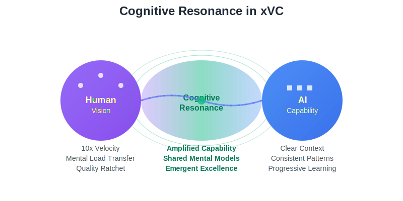

# Extreme Vibe Coding (xVC)

<div align="center">
  
  
  **A methodology for effective human-LLM collaboration in software development**
  
  <br/>
  
  **[🌟 Choose Your Path](docs/paths/)** • 
  **[🚀 Getting Started](docs/guides/getting-started.md)** • 
  **[📖 Guides](docs/guides/)** • 
  **[🧠 Concepts](docs/concepts/)** • 
  **[🔧 Reference](docs/reference/)** • 
  **[💡 Case Studies](docs/case-studies/)** • 
  **[🏛️ Architecture](docs/adr/)** • 
  **[📝 Changelog](CHANGELOG.md)**
</div>

---

## Overview

Many developers experience frustration when working with LLMs—inconsistent results, constant corrections, and feeling like they're fighting the tools. xVC provides a systematic approach to human-LLM collaboration that transforms this relationship from adversarial to productive.

**Core insight**: LLMs work best when treated as pattern reflection engines rather than intelligent agents. They excel at consistently applying patterns you establish, not at independent reasoning.

## What is Extreme Vibe Coding?

xVC is a development methodology that establishes effective patterns for human-LLM collaboration. Through structured interactions, consistent principles, and systematic practice, developers achieve reliable, high-quality results from LLM assistance.

**Measurable outcomes**: Developers report significant velocity improvements while maintaining or improving code quality, documentation completeness, and system maintainability.

**Key principle**: Instead of expecting LLMs to understand context independently, you provide clear patterns and constraints that enable consistent, predictable assistance.

## Choose Your xVC Journey

**Different backgrounds, same destination: mastery of human-AI collaboration that creates extraordinary results.**

<div align="center">

| 🌟 **Wonder & Discovery** | 🔧 **Practitioner's Track** | 🌟 **Understanding** | 💼 **Strategic Value** |
|:---:|:---:|:---:|:---:|
| *For curious minds and future builders* | *For engineers who want results now* | *For technology enthusiasts* | *For business leaders* |
| Learn through adventure and experimentation | Skip theory, learn patterns, get 3-5x productivity | Understand the science and implications | Evaluate ROI and competitive advantage |
| **[Begin Adventure](docs/paths/discovery/)** | **[Get Productive](docs/paths/practitioner/)** | **[Explore Science](docs/paths/understanding/)** | **[Assess Value](docs/paths/business/)** |

</div>

**Not sure which path?** → **[Choose Your Path Guide](docs/paths/)**

**Want to experience xVC first?** → **[30-Minute First Session](docs/tutorials/first-session.md)**

## Approach Comparison

<div align="center">
  
</div>

### Common Approach: Ad-hoc LLM Usage
```
Developer → LLM → Inconsistent Results
      ↓
Repetitive prompt adjustments, quality variance, manual corrections
```

### xVC Approach: Structured Collaboration
```
Human Direction → Pattern-Based LLM → Consistent Output
         ↓                     ↓                    ↓
   Clear Intent        Established Patterns    Reliable Results
```

## Core Components

### 🧠 Component 1: Pattern Consistency
**Definition**: Establishing repeatable interaction patterns that produce reliable results.

**Characteristics**: 
- LLM responses become predictable and useful
- Code output matches your established conventions
- Architectural decisions follow documented principles
- Quality metrics improve over successive iterations

**Implementation**: Through consistent prompt patterns, clear context setting, and systematic reinforcement of successful approaches.

**Key insight**: LLMs excel at pattern matching and application—focus on providing clear, consistent patterns rather than expecting contextual understanding.

### 🎯 Component 2: Development Principles
**Purpose**: Consistent standards that guide all code and architectural decisions.

**Core principles**:

1. **One Source of Truth** - Eliminate duplicate implementations
2. **Surgical Precision** - Minimal changes for maximum impact  
3. **Bar-Raising Solutions** - Every change improves the system
4. **Forward Progress Only** - No regressions accepted
5. **Always Solve Never Mask** - Fix root causes, don't work around them

**Application**: These principles provide clear decision criteria when working with LLMs. They prevent common pitfalls like accepting quick fixes that create technical debt or allowing duplicated functionality.

**Benefit**: Consistent application of principles prevents complexity accumulation and maintains system integrity over time.

### 🔄 Component 3: Iterative Improvement
**Process**: Systematic approach to maintaining and improving code quality over time.

**Workflow**:
1. **Planning** → Define clear objectives and constraints
2. **Implementation** → Apply established patterns with LLM assistance
3. **Review** → Evaluate results against quality standards
4. **Integration** → Commit validated improvements to codebase
5. **Documentation** → Update patterns and principles based on learnings

**Outcome**: Each iteration builds on previous work, creating compound improvements in code quality, development velocity, and system maintainability.

## Implementation Timeline

<div align="center">
  
</div>

### 📚 Initial Learning (Weeks 1-2)
**Focus**: Establishing effective interaction patterns with LLMs.

**Key shift**: From expecting LLMs to infer context to providing clear, structured inputs.

**Measurable improvements**:
- **Reduced iteration cycles**: Fewer back-and-forth corrections needed per task
- **More consistent outputs**: LLM responses become more predictable and useful
- **Effective prompt patterns**: Development of reusable prompt templates for common tasks
- **Quality consistency**: Generated code begins to match your coding standards reliably

**Objective**: Build a foundation of reliable human-LLM interaction patterns.

### 🚀 Productivity Phase (Weeks 3-8)
**Focus**: Optimizing established patterns for maximum effectiveness.

**Key development**: Mature prompt patterns enable reliable, high-quality output with minimal oversight.

**Measurable outcomes**:
- **Significant velocity gains**: Tasks that previously required hours can often be completed in significantly less time
- **Quality maintenance**: Faster development doesn't compromise code quality when patterns are well-established
- **Reduced cognitive load**: Less time spent on implementation details allows focus on architecture and design
- **Improved documentation**: Documentation becomes part of the development workflow rather than a separate task

**Achievement**: Effective human-LLM collaboration becomes a reliable development multiplier.

### 🎯 Proficiency Phase (Months 3+)
**Development**: xVC becomes integrated workflow. Standard development practice.

**Characteristics**: Pattern application becomes automatic. Consistent results with minimal cognitive overhead. Human-LLM collaboration operates efficiently.

**Performance Indicators**:
- **Process internalization**: Established patterns apply automatically without conscious effort
- **Solution innovation**: Novel architectural approaches emerge from systematic pattern application
- **Quality consistency**: Code output maintains high standards with reduced review cycles
- **Velocity improvement**: Complex implementations completed in significantly reduced timeframes

## Case Study: JDBX Implementation

```yaml
Project: JDBX (JSON Database eXtended)
Duration: 3 months  
Language: C
Scale: 100,000+ lines
Human Code Written: <100 lines (configuration only)
Result: Production-ready database with enterprise features

Implemented Features:
├── **Unified document architecture**: Single collection storage model for all entities
├── **Checkpoint-based memory management**: Frame-based allocation tracking with restore capability
├── **Enterprise RBAC with JWT**: Complete role-based access control with token management
├── **SSL/TLS production support**: Full cryptographic stack with certificate validation
├── **JavaScript engine integration**: Embedded QuickJS runtime with security boundaries
├── **ACID transactions**: Database-grade transaction semantics with rollback capability
├── **Zero memory leaks**: Systematic allocation tracking and boundary validation
└── **Sub-millisecond performance**: Optimized operation latency

Technical Achievements:
- Memory safety in C without performance overhead
- Production-grade authentication implementation
- Enterprise feature set with maintainable complexity
- Current documentation throughout development
- Comprehensive quality validation
```

**Technical Approach**: JDBX demonstrates systematic human-LLM collaboration. Strategic decisions and architectural vision remained human-driven, while LLM assistance accelerated implementation through consistent pattern application.

## Why This Works (The Science)

### The Pattern Reflection Insight
What we call "LLMs" or "AI" are pattern reflection engines—sophisticated mirrors that reflect human-written patterns from their training data. When you understand this:

- You stop expecting reasoning and start providing direction
- You stop fighting their nature and start leveraging it
- You stop being disappointed by their limitations and start being amazed by their capabilities

### The Intelligence Monopoly
Intelligence—true intelligence—remains exclusively human:
- **Reasoning**: When you debug a race condition by mentally tracing execution paths and forming hypotheses about timing, that's reasoning. Pattern reflectors can suggest common solutions, but they can't reason about your specific context.
- **Vision**: When you imagine a database where "everything is a document" before any such system exists, that's vision. Pattern reflectors can only reflect patterns that already exist in their training—they cannot dream new architectures.
- **Judgment**: When you decide that checkpoint-based memory management is "elegant" while reference counting feels "clunky," that's judgment. Aesthetics, taste, and value assessment remain uniquely human.
- **Strategy**: When you plan to build core functionality first, then add security, then optimize performance—considering dependencies and risk—that's strategic thinking. Pattern reflectors excel at tactics but cannot think strategically.

### The Amplification Effect
When human intelligence directs pattern reflection:
- **Reasoning scales through automation**: Pattern identification enables systematic application across large codebases
- **Architectural consistency**: Established design principles maintain uniformity across all system components
- **Quality standards application**: Coding standards and best practices apply systematically throughout implementation
- **Strategic execution**: High-level plans execute with consistent attention to detail at all levels

**Outcome**: Human intelligence amplified through systematic pattern application.

## The xVC Difference

### What This Is NOT
- ❌ **Prompt Engineering** - This is intelligence amplification
- ❌ **Code Generation** - This is cognitive partnership
- ❌ **AI Programming** - This is pattern-directed development
- ❌ **Human Replacement** - This is human potential unleashed

### What This IS
- ✅ **Cognitive Amplification** - Your intelligence working at scale
- ✅ **Quality Emergence** - Excellence arising from principled interaction
- ✅ **Velocity Multiplication** - Speed without sacrificing quality
- ✅ **Sustainable Development** - Code that improves over time

## The Reality Check

### This Isn't Magic
xVC requires:
- **Discipline** to maintain principles under pressure
- **Patience** to establish patterns correctly  
- **Persistence** to work through the learning curve
- **Precision** in communication and thinking

### This Isn't Easy
The methodology demands:
- Clear thinking about complex problems
- Consistent application of principles
- Continuous learning and adaptation
- Intellectual honesty about what's working

### This IS Transformative
When mastered, xVC:
- Changes how you think about problem-solving
- Transforms your relationship with complexity
- Accelerates your development beyond belief
- Produces code quality that surprises even you

## Your Journey Starts Here

### Step 1: Understand the Foundation
Read [Intelligence and Reflection](docs/concepts/philosophy/intelligence-and-reflection.md) to understand what you're really working with.

### Step 2: Learn the Principles  
Master the [Core Principles](docs/concepts/principles/README.md) that will guide every decision.

### Step 3: Take Your First Session
Follow [Getting Started](docs/guides/getting-started.md) for your first 30-minute xVC experience.

### Step 4: Build Your Practice
Use [Session Management](docs/guides/session-management.md) to develop sustainable productivity.

### Step 5: Join the Evolution
Study [Case Studies](docs/case-studies/) to see what becomes possible.

## Essential Resources

### 🧠 **Understanding the Game**
- [Intelligence vs Reflection](docs/concepts/philosophy/intelligence-and-reflection.md) - The fundamental truth
- [Understanding Pattern Reflectors](docs/concepts/psychology/understanding-llms.md) - How these systems really work
- [Terminology Reality Check](docs/reference/terminology-reality-check.md) - Why "AI" is misleading

### 🎯 **Building Excellence**  
- [Core Principles](docs/concepts/principles/README.md) - The physics of your code universe
- [The Practitioner's Guide](docs/guides/dos-and-donts.md) - What to do and what to avoid
- [Session Management](docs/guides/session-management.md) - Orchestrating the symphony

### 📚 **Learning from Battle**
- [JDBX Lessons](docs/case-studies/jdbx-lessons.md) - 100k lines in 3 months
- [The N-1 Byte Crisis](docs/case-studies/n1-byte-crisis.md) - Learning from challenges
- [Letting the Cave Echo](docs/methodology/letting-the-cave-echo.md) - The art of observation

## Implementation Considerations

### For Individual Developers
Focus on establishing effective human-LLM collaboration patterns. Systematic application of xVC principles produces measurable productivity improvements.

### For Development Teams
Effective xVC practitioners demonstrate significant velocity advantages while maintaining code quality standards. Team adoption requires methodical training and pattern establishment.

### For Technology Organizations  
Organizations report measurable improvements in development velocity and code quality. Implementation requires commitment to systematic methodology adoption.

### Strategic Perspective
xVC represents human intelligence amplification through structured LLM collaboration, not replacement of human decision-making with automated systems.

## Summary

xVC provides a systematic approach to human-LLM collaboration based on treating LLMs as pattern reflection engines rather than independent reasoning systems. This understanding enables consistent, high-quality results through structured interaction patterns.

Developers learn to provide clear direction and established constraints that enable reliable LLM assistance while maintaining human responsibility for strategic decisions and quality standards.

**Expected outcomes**: Improved development velocity, consistent code quality, and effective human-LLM collaboration.

**Get started**: → [Begin with your first session](docs/guides/getting-started.md)

---

*This methodology documentation was developed through systematic application of xVC principles, demonstrating the practical effectiveness of structured human-LLM collaboration.*