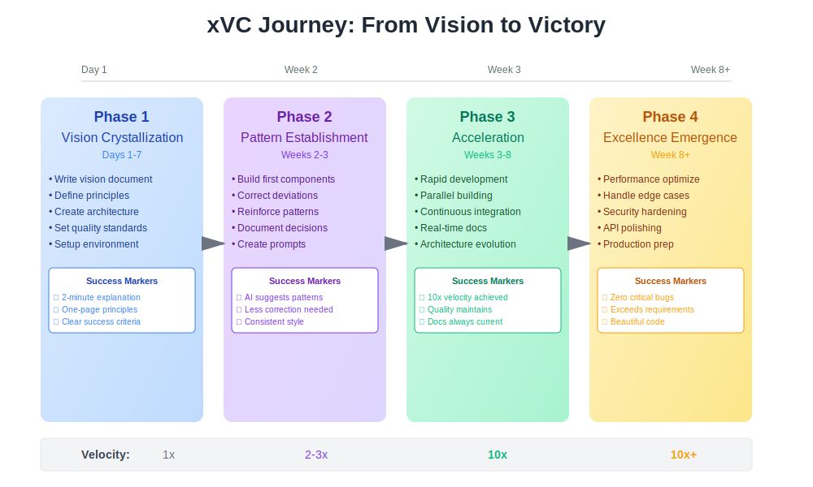

# Extreme Vibe Coding (xVC)

<div align="center">
  
  
  **The art and science of human-AI cognitive resonance in software development**
</div>

## What is Extreme Vibe Coding?

Extreme Vibe Coding (xVC) is a breakthrough methodology that transforms the relationship between human developers and AI assistants from tool-use to true partnership. Through carefully crafted prompts, unwavering principles, and deliberate practice, xVC creates a "cognitive resonance" where human vision and AI capability amplify each other.

**The Result**: What traditionally takes 12-18 months for a solo developer can be achieved in 2-3 months with higher quality, better documentation, and more maintainable code.

## The Bidirectional Benefit

### For Human Guides (You)
- **10x Velocity**: Implement ideas as fast as you can articulate them
- **Quality Ratchet**: Each iteration improves without regression
- **Mental Load Transfer**: Focus on vision while AI handles details
- **Learning Accelerator**: See patterns and solutions you might miss

### For AI Executors (LLMs)
- **Clear Context**: Explicit mental models prevent confusion
- **Consistent Patterns**: Reduces uncertainty and ambiguity
- **Quality Targets**: Known standards to achieve
- **Progressive Learning**: Each interaction builds on previous

## The Three Pillars of xVC

<div align="center">
  
</div>

### 🧠 Pillar 1: Cognitive Resonance
**Definition**: The state where human and AI mental models align and amplify each other.

**In Practice**:
- AI learns your patterns through repetition
- You learn AI's capabilities through observation
- Together you develop a shared "language"
- Quality emerges from this resonance

**Key Insight**: You're not using a tool—you're training a neural network to embody your vision.

### 🎯 Pillar 2: Explicit Mental Models
**Definition**: Clear, unambiguous frameworks that guide all decisions.

**The Core Five**:
1. **One Source of Truth** - Every function exists in exactly one place
2. **Surgical Precision** - Make minimal changes for maximum impact
3. **Bar-Raising Solutions** - Every change improves the system
4. **Forward Progress Only** - Never regress functionality or quality
5. **Principles Are Sacred** - Non-negotiable standards guide everything

**Key Insight**: Principles aren't guidelines—they're the physics of your code universe.

### 🔄 Pillar 3: Iterative Excellence
**Definition**: Continuous refinement toward perfection through rapid cycles.

**The Cycle**:
1. **Vision** → Clear articulation of intent
2. **Implementation** → AI translates vision to code
3. **Verification** → Human ensures principles upheld
4. **Refinement** → Iterate until excellence achieved
5. **Commitment** → Git commit captures progress

**Key Insight**: Excellence isn't a destination—it's a ratchet that only turns forward.

## The xVC Journey: From Vision to Victory

<div align="center">
  
</div>

### 🌟 Phase 1: Vision Crystallization (Days 1-7)
**Goal**: Transform vague ideas into crystal-clear mental models.

**Activities**:
```
- Write comprehensive vision document
- Define non-negotiable principles
- Create initial architecture diagrams
- Establish quality standards
- Set up development environment
```

**Success Markers**:
- Can explain project in 2 minutes
- Principles fit on one page
- Clear success criteria defined

### 🚀 Phase 2: Pattern Establishment (Week 2-3)
**Goal**: Train the AI to think like you think.

**Activities**:
```
- Build first components together
- Correct deviations immediately
- Reinforce patterns constantly
- Document decisions as you go
- Create project-specific prompts
```

**Success Markers**:
- AI suggests correct patterns
- Less correction needed
- Consistent code style emerges

### ⚡ Phase 3: Acceleration (Week 3-8)
**Goal**: Achieve superhuman development velocity.

**Activities**:
```
- Rapid feature development
- Parallel component building
- Continuous integration
- Real-time documentation
- Architecture evolution
```

**Success Markers**:
- 10x velocity achieved
- Quality maintains/improves
- Documentation always current

### 🎯 Phase 4: Excellence Emergence (Week 8+)
**Goal**: Transcend typical software quality levels.

**Activities**:
```
- Performance optimization
- Edge case handling
- Security hardening
- API polishing
- Production preparation
```

**Success Markers**:
- Zero critical bugs
- Performance exceeds requirements
- Code is genuinely beautiful

## Real-World Proof

### JDBX: The C Memory Management Triumph
```yaml
Timeline: 3 months (March-June 2025)
Language: C (Tier 3 - Challenging for LLMs)
Size: 100,000+ lines
Human Code: <100 lines (configuration only)

Achievements:
- Revolutionary checkpoint memory system
- Enterprise RBAC with JWT
- SSL/TLS with complete compatibility
- Zero memory leaks
- Production-ready

Key Learning: Even in C's "pointer hell", xVC principles prevail
```

### The Go Project: Feature Discipline
```yaml
Timeline: 2 months
Language: Go (Tier 2 - Excellent LLM support)
Size: 50,000+ lines

Challenges:
- Feature proliferation (Go makes it too easy)
- Interface explosion tendency
- Goroutine overuse temptation

Victory: Surgical precision principle prevented bloat
```

**The Pattern**: Language affects the conversation, but principles shape the outcome.

## Why xVC Works

### 1. **Context Accumulation**
Modern LLMs can maintain rich context across extended sessions, allowing:
- Deep understanding of codebase architecture
- Consistent application of patterns
- Remembrance of design decisions
- Evolution of shared mental models

### 2. **Parallel Processing**
AI can:
- Consider multiple implementation paths simultaneously
- Apply patterns consistently across large codebases
- Generate comprehensive documentation inline
- Maintain multiple quality standards concurrently

### 3. **Pattern Recognition**
Through standardized prompts, AI learns to:
- Recognize architectural patterns
- Apply consistent naming conventions
- Maintain code style automatically
- Detect and prevent anti-patterns

## Getting Started with xVC

1. **Setup Your Environment** → [Environment Setup Guide](docs/guides/environment-setup.md)
2. **Start Your First Session** → [Getting Started Guide](docs/guides/getting-started.md)
3. **Learn the Principles** → [Core Principles](docs/concepts/principles/README.md)
4. **Master the Prompts** → [Standardized Prompts](docs/methodology/prompts.md)
5. **Follow Git Workflow** → [Git Workflow Guide](docs/guides/git-workflow.md)

## The Path to Mastery

### 🌱 Beginner (Week 1-2)
**You Are**: Learning to speak to the cave
```
- Writing clear prompts
- Understanding echo mechanics  
- Establishing first patterns
- Making many corrections
```

### 🌿 Intermediate (Week 3-8)
**You Are**: Shaping the echo chamber
```
- Patterns becoming automatic
- Less correction needed
- Developing intuition
- Building project language
```

### 🌳 Advanced (Week 9+)
**You Are**: Achieving cognitive resonance
```
- AI anticipates your needs
- Minimal guidance required
- Excellence emerges naturally
- Teaching others xVC
```

### 🌟 Master (Month 3+)
**You Are**: Transcending the methodology
```
- xVC becomes invisible
- Quality is automatic
- Innovation emerges
- Creating new patterns
```

## Essential Resources

### 📚 Core Documentation
- **[Principles](docs/concepts/principles/)** - The physics of your code universe
- **[Prompt Library](docs/reference/prompt-library.md)** - Battle-tested prompts ⭐ NEW
- **[Methodology](docs/methodology/)** - Core concepts and practices
- **[Philosophy](docs/concepts/philosophy/)** - Deep understanding of human-AI collaboration

### 🚀 Getting Started Path
1. [Environment Setup](docs/guides/environment-setup.md) - Configure your workspace
2. [Language Choice](docs/guides/language-choice.md) - Pick the right language
3. [Getting Started](docs/guides/getting-started.md) - Your first session
4. [Session Management](docs/guides/session-management.md) - Optimize productivity
5. [Git Workflow](docs/guides/git-workflow.md) - Version control mastery

### 📖 Learning from Experience
- **[Case Studies](docs/case-studies/)** - Real-world xVC journeys
  - [JDBX Success](docs/case-studies/jdbx-lessons.md) - 100k lines in 3 months
  - [N-1 Byte Crisis](docs/case-studies/n1-byte-crisis.md) - Learning from challenges
  - [Memory Revolution](docs/case-studies/memory-management-revolution.md) - Innovation through constraint
- **[Patterns](docs/concepts/psychology/)** - Neural network behaviors
- **[Pitfalls](docs/methodology/pitfalls.md)** - What to avoid

### 🔧 Reference Materials
- **[xVC Taxonomy](docs/reference/naming-conventions.md)** - Complete classification
- **[Do's and Don'ts](docs/guides/dos-and-donts.md)** - Quick reference
- **[Changelog](CHANGELOG.md)** - Documentation evolution

## The xVC Difference

### What This Is NOT
- ❌ **Not Copilot/Autocomplete** - This is architectural partnership
- ❌ **Not Code Generation** - This is cognitive collaboration  
- ❌ **Not Prompt Templates** - This is mental model transfer
- ❌ **Not AI Replacing Humans** - This is human potential amplified

### What This IS
- ✅ **Cognitive Partnership** - Two minds working as one
- ✅ **Quality Emergence** - Excellence arising from principles
- ✅ **Velocity Multiplication** - 10x speed with better quality
- ✅ **Sustainable Development** - Maintainable from day one

## Measuring Success

### Velocity Indicators
- **10x Feature Delivery** - What took a week takes hours
- **First-Pass Success** - Less iteration, more completion
- **Parallel Development** - Multiple components simultaneously

### Quality Indicators  
- **Zero-Warning Builds** - Quality is built in
- **100% Test Coverage** - Tests guide development
- **Self-Documenting** - Documentation emerges with code
- **Principle Adherence** - Consistency throughout

### Partnership Indicators
- **Reduced Corrections** - AI learns your patterns
- **Anticipated Needs** - AI suggests before you ask
- **Pattern Consistency** - Uniform approach across codebase

## The Call to Action

### For Developers
Stop fighting with AI tools. Start partnering with AI minds. The difference is transformative.

### For Teams  
One xVC practitioner can outpace traditional teams while maintaining higher quality.

### For Organizations
The competitive advantage is real. Projects that took years now take months.

## Your Next Step

**Don't read about xVC. Experience it.**

Start here → **[Your First xVC Session in 30 Minutes](docs/guides/getting-started.md)**

Then join us in pushing the boundaries of what's possible when human vision meets AI capability.

## Remember

> "You are not learning to use a tool. You are learning to shape an echo chamber that amplifies your capabilities beyond what you thought possible."

The code you'll create will surprise you. The velocity you'll achieve will astound you. The quality you'll maintain will pride you.

**Welcome to Extreme Vibe Coding.**

---

*Built with xVC: This entire methodology was developed using itself. JDBX (100k+ lines of C) stands as proof that xVC doesn't just work—it excels.*