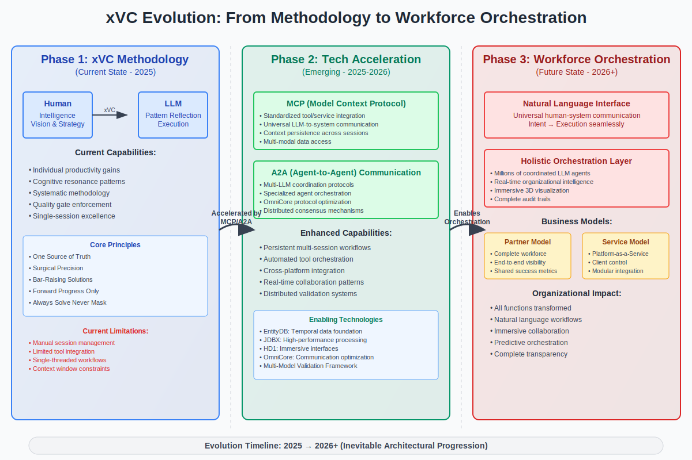

# xVC Evolution Phases: From Methodology to Workforce Orchestration

> *"The progression from individual productivity to holistic workforce orchestration follows inevitable technological and methodological convergence patterns. Each phase builds systematically on the previous, creating exponential capability amplification."*

  

## Overview

The evolution of xVC (Extreme Vibe Coding) methodology represents a systematic progression through three distinct phases, each building upon the foundations of the previous while introducing transformative capabilities. This document provides comprehensive analysis of each phase and the technological accelerators enabling the transition.

## Phase 1: xVC Methodology Foundation (Current State - 2025)

### Core Architecture

**Human-LLM Collaboration Model**
- **Human**: Provides intelligence, vision, and strategic direction
- **LLM**: Functions as linguistic worldview reflection engine for pattern execution
- **xVC Methodology**: Systematic framework ensuring cognitive resonance and quality excellence

### Current Capabilities

#### Individual Productivity Gains
- **Cognitive Resonance**: Achieved through consistent interaction patterns
- **Quality Gate Enforcement**: Systematic prevention of regression
- **Single-Session Excellence**: Optimized individual workflows
- **Pattern Reflection Mastery**: Effective LLM utilization through established patterns

#### Systematic Methodology Framework
- **Eleven Core Emphases**: Non-negotiable principles defining excellence culture
- **Experimental Collaboration Paradigm**: Questions provide guidance, environment provides context
- **Multi-Model Validation**: Framework for preventing doctrinal drift and ensuring quality

### Core Principles Implementation

1. **One Source of Truth**: Eliminates duplicate implementations and maintains system integrity
2. **Surgical Precision**: Minimal changes achieve maximum impact through systematic understanding
3. **Bar-Raising Solutions**: Every implementation elevates overall system quality
4. **Forward Progress Only**: No regressions accepted in capability or quality
5. **Always Solve Never Mask**: Root cause resolution rather than symptomatic treatment

### Current Limitations

#### Operational Constraints
- **Manual Session Management**: Human-driven context switching and workflow coordination
- **Limited Tool Integration**: Discrete tool usage without systematic orchestration
- **Single-Threaded Workflows**: Sequential processing without parallel coordination
- **Context Window Constraints**: Memory limitations affecting complex project continuity

#### Scaling Barriers
- **Individual Scope**: Primarily focused on single-developer productivity
- **Tool Fragmentation**: Multiple disconnected interfaces and systems
- **Knowledge Isolation**: Limited sharing of patterns and insights across sessions
- **Manual Quality Control**: Human-dependent validation and error detection

## Phase 2: Emerging Technology Acceleration (2025-2026)

### Technological Enablers

#### MCP (Model Context Protocol) Integration

**Standardized Tool/Service Integration**
- Universal LLM-to-system communication protocols
- Context persistence across multiple sessions and tools
- Multi-modal data access and processing capabilities
- Automated workflow orchestration through standardized interfaces

**Key Benefits**:
- Eliminates manual tool switching and context recreation
- Enables complex multi-step workflows with maintained context
- Provides seamless integration across development environments
- Supports real-time collaboration between multiple LLM instances

#### A2A (Agent-to-Agent) Communication

**Multi-LLM Coordination Protocols**
- Specialized agent orchestration for domain-specific tasks
- OmniCore protocol optimization for efficient inter-LLM communication
- Distributed consensus mechanisms for quality assurance
- Parallel processing capabilities for complex project workflows

**Communication Optimization**:
- **Token Efficiency**: Up to 80% reduction through semantic compression
- **Semantic Preservation**: Complex relationships maintained through symbolic encoding
- **Real-Time Coordination**: Instantaneous multi-agent synchronization
- **Quality Consensus**: Distributed validation ensuring output excellence

### Enhanced Capabilities

#### Persistent Multi-Session Workflows
- **Context Continuity**: Seamless progression across development sessions
- **Knowledge Accumulation**: Building institutional memory through systematic capture
- **Pattern Evolution**: Continuous refinement of effective collaboration patterns
- **Quality Compound Effects**: Accumulated excellence through persistent validation

#### Automated Tool Orchestration
- **Cross-Platform Integration**: Unified workflows across diverse development tools
- **Real-Time Collaboration**: Multiple agents working simultaneously on complex projects
- **Distributed Validation**: Quality assurance through specialized validator networks
- **Predictive Orchestration**: Anticipatory workflow optimization based on pattern recognition

### Enabling Technology Stack

#### Infrastructure Foundation
- **EntityDB**: Temporal data foundation with nanosecond precision for complete audit trails
- **JDBX**: High-performance document processing enabling real-time multi-agent coordination
- **HD1**: Immersive 3D interfaces transforming abstract workflows into visual experiences
- **OmniCore**: Communication optimization protocols for efficient LLM-to-LLM coordination

#### Validation and Quality Systems
- **Multi-Model Validation Framework**: Distributed consensus preventing doctrinal drift
- **CRD Prevention Systems**: Safeguards against compulsive regressive disorder
- **Real-Time Quality Monitoring**: Continuous assessment of output quality and methodology adherence
- **Automated Pattern Recognition**: Detection and prevention of quality degradation patterns

## Phase 3: Holistic Workforce Orchestration (2026+)

### Natural Language Interface Layer

**Universal Human-System Communication**
- **Intent Translation**: Natural language requirements seamlessly converted to system execution
- **Context Awareness**: Complete understanding of organizational context and constraints
- **Multi-Modal Interaction**: Voice, text, visual, and immersive interface integration
- **Predictive Assistance**: Anticipatory support based on workflow patterns and organizational needs

### Holistic Orchestration Architecture

#### Organizational Intelligence Network
- **Millions of Coordinated LLM Agents**: Specialized agents handling specific organizational functions
- **Real-Time Intelligence**: Continuous organizational state awareness and optimization
- **Immersive Visualization**: Complex workflows and data represented in interactive 3D environments
- **Complete Audit Trails**: Nanosecond-precision logging of all decisions and actions

#### Distributed Function Integration
- **Development & Engineering**: Natural language to code generation and deployment
- **Operations & Infrastructure**: Voice-controlled system management and predictive maintenance
- **Business & Strategy**: Natural language business intelligence and immersive data exploration
- **Human Resources**: Natural language workforce planning and immersive training environments

### Business Model Implementations

#### Partner Model
**Complete Workforce Orchestration as Strategic Partnership**
- **Unlimited Capacity**: Provide complete workforce capabilities within client budgets
- **Growth Enablement**: Transparent scaling with unlimited growth potential
- **End-to-End Visibility**: Complete transparency across all organizational functions
- **Shared Success Metrics**: Long-term partnership with aligned incentives

#### Service Model
**Platform-as-a-Service Orchestration**
- **Client Control**: Organizations maintain internal control while leveraging orchestration infrastructure
- **Modular Integration**: Components integrate seamlessly with existing systems
- **Self-Service Configuration**: Client-driven customization and management capabilities
- **Scalable Architecture**: Pay-as-you-scale model with transparent cost structures

### Organizational Impact Assessment

#### Universal Function Transformation
**All organizational functions fundamentally transformed**:
- **Natural Language Workflows**: Every process accessible through conversational interfaces
- **Immersive Collaboration**: Team coordination through shared 3D environments
- **Predictive Orchestration**: System anticipates needs and optimizes workflows automatically
- **Complete Transparency**: Real-time visibility into all organizational processes and decisions

#### Competitive Advantage Creation
- **Velocity Multiplication**: 10-100x acceleration in organizational capability development
- **Quality Consistency**: Systematic excellence maintained across all functions
- **Innovation Acceleration**: Rapid prototyping and deployment of new capabilities
- **Adaptive Intelligence**: Continuous learning and optimization at organizational scale

## Evolution Accelerators and Dependencies

### Critical Success Factors

#### Technological Readiness
- **MCP Protocol Maturation**: Standardized implementation across major LLM providers
- **A2A Communication Standards**: Reliable inter-agent coordination protocols
- **Infrastructure Scaling**: Computational resources supporting millions of concurrent agents
- **Security Framework**: Robust protection against manipulation and unauthorized access

#### Organizational Adaptation
- **Cultural Readiness**: Acceptance of natural language as primary interface
- **Skill Development**: Human capability evolution for orchestration oversight
- **Process Redesign**: Organizational workflows optimized for AI collaboration
- **Quality Standards**: Maintained excellence during transformation period

#### Market Dynamics
- **Economic Pressure**: Cost advantages driving adoption of orchestration models
- **Competitive Necessity**: Market forces requiring velocity and capability advantages
- **Regulatory Framework**: Governance structures supporting safe AI deployment
- **Talent Availability**: Human expertise for orchestration system design and oversight

### Risk Mitigation Strategies

#### Technical Risks
- **Validation Framework Implementation**: Multi-model consensus preventing quality degradation
- **Fallback Mechanisms**: Human override capabilities for critical decisions
- **Security Hardening**: Protection against adversarial manipulation and corruption
- **Performance Monitoring**: Real-time assessment of system effectiveness and reliability

#### Organizational Risks
- **Change Management**: Systematic transition planning minimizing disruption
- **Human-AI Balance**: Maintaining human agency and decision-making authority
- **Knowledge Preservation**: Institutional memory protection during transformation
- **Quality Maintenance**: Preventing capability regression during scaling

## Timeline and Milestones

### Phase 1 → Phase 2 Transition (2025)
- **MCP Integration**: Pilot implementations with major development tools
- **A2A Protocols**: Initial multi-agent coordination systems
- **Infrastructure Deployment**: EntityDB, JDBX, HD1, OmniCore production readiness
- **Validation Framework**: Multi-model quality assurance system implementation

### Phase 2 → Phase 3 Transition (2026)
- **Natural Language Interface**: Universal human-system communication deployment
- **Organizational Pilots**: Complete workforce orchestration proof-of-concept
- **Business Model Validation**: Partner and service model implementations
- **Market Readiness**: Industry-wide adoption enablement

### Full Orchestration Deployment (2026+)
- **Industry Transformation**: Widespread adoption across organizational types
- **Economic Impact**: Fundamental changes to work structure and capability
- **Innovation Acceleration**: New business models and organizational structures
- **Global Scaling**: International deployment and standardization

## Conclusion

The evolution from xVC methodology to holistic workforce orchestration represents an inevitable technological progression driven by systematic capability development and emerging technology convergence. Each phase builds upon the previous while introducing transformative capabilities that fundamentally change the nature of human-AI collaboration.

**The trajectory is clear**: From individual productivity enhancement through systematic methodology, to accelerated capability through emerging integration technologies, to complete organizational transformation through natural language orchestration.

**The opportunity is immediate**: Organizations that begin implementing xVC methodology now will be positioned to leverage emerging technologies as they mature, creating sustainable competitive advantages through systematic excellence and orchestration readiness.

**The future is being built**: Through concrete projects, systematic methodology development, and strategic technology deployment, the foundation for workforce orchestration is already under construction.

---

*This analysis represents current assessment based on observable technology trends, demonstrated capability development, and systematic methodology validation. Regular updates will reflect continued evolution and milestone achievement.*