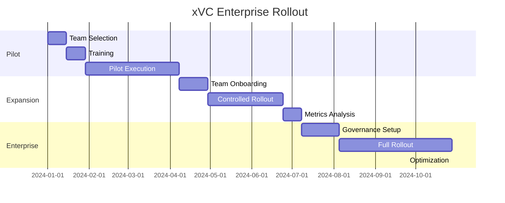

# xVC Enterprise Adoption Playbook

## Executive Summary

xVC adoption in enterprises requires careful planning, risk mitigation, and systematic rollout. This playbook provides a proven path from pilot to enterprise-wide transformation.

## Phase 1: Pilot Program (Month 1-3)

### Pilot Team Selection
```
Ideal Pilot Team:
- 1 Senior Developer (xVC Champion)
- 2 Mid-level Developers (Early Adopters)
- 1 Junior Developer (Fresh Perspective)
- 1 Technical Manager (Stakeholder)

Selection Criteria:
- Open to new methodologies
- Strong communication skills
- Measured risk-takers
- Influential within organization
```

### Pilot Project Selection
```
Ideal Pilot Project:
- Medium complexity (3-6 month traditional estimate)
- Non-critical but valuable
- Clear success metrics
- Visible to leadership
- Representative of typical work

Avoid:
- Mission-critical systems
- Legacy maintenance
- Poorly defined requirements
- Political hot potatoes
```

### Week 1-2: Foundation
```yaml
Training Schedule:
  Day 1-2: xVC Principles & Philosophy
  Day 3-4: Hands-on Workshop  
  Day 5: Metric Setup & Tracking

Deliverables:
  - Pilot charter document
  - Success criteria definition
  - Risk mitigation plan
  - Communication strategy
```

### Week 3-12: Execution
```yaml
Weekly Cadence:
  Monday: Sprint planning with xVC
  Tuesday-Thursday: Development
  Friday: Metrics review & retrospective

Monthly Reviews:
  - Velocity trends
  - Quality metrics
  - Team satisfaction
  - Stakeholder feedback
```

### Pilot Success Metrics
```yaml
Quantitative:
  - Velocity: Target 5x improvement
  - Defects: <2 per KLOC
  - Coverage: >90% automated tests
  - Time to Market: 50% reduction

Qualitative:
  - Developer satisfaction
  - Code maintainability
  - Documentation quality
  - Stakeholder confidence
```

## Phase 2: Controlled Expansion (Month 4-6)

### Expansion Strategy
```yaml
Team Selection:
  - 3-5 additional teams
  - Different departments/products
  - Varying project types
  - Mix of skeptics and enthusiasts

Support Structure:
  - Original pilot team as mentors
  - Weekly office hours
  - Shared pattern library
  - Central metrics dashboard
```

### Risk Mitigation Framework

#### Technical Risks
| Risk | Probability | Impact | Mitigation |
|------|-------------|---------|------------|
| AI API Downtime | Medium | High | Multi-provider fallback |
| Context Limitations | High | Medium | Modular architecture |
| Quality Variance | Medium | High | Strict principles |
| Security Concerns | Low | Critical | Private deployment option |

#### Organizational Risks
| Risk | Probability | Impact | Mitigation |
|------|-------------|---------|------------|
| Developer Resistance | High | High | Success stories, gradual rollout |
| Management Skepticism | Medium | Critical | ROI data, executive briefings |
| Process Conflicts | Medium | Medium | Integration, not replacement |
| Skill Gaps | High | Medium | Comprehensive training |

#### Mitigation Strategies
```yaml
Technical Mitigations:
  - Hybrid approach (xVC + traditional backup)
  - Phased rollout by project type
  - Extensive testing protocols
  - Security audit of all AI interactions

Organizational Mitigations:
  - Change champions in each team
  - Success story repository
  - Regular town halls
  - Executive sponsor program
```

## Phase 3: Enterprise Rollout (Month 7-12)

### Governance Structure
```yaml
xVC Center of Excellence:
  Director:
    - Strategy & vision
    - Executive communication
    - Budget management
  
  Technical Lead:
    - Pattern library maintenance
    - Tool selection
    - Best practices evolution
  
  Training Lead:
    - Onboarding programs
    - Certification development
    - Continuous education
  
  Metrics Lead:
    - ROI tracking
    - Quality assurance
    - Performance optimization
```

### Implementation Roadmap


### Change Management Strategy

#### Communication Plan
```yaml
Stakeholder Communications:
  Executives:
    - Monthly ROI reports
    - Quarterly business reviews
    - Success story highlights
  
  Managers:
    - Weekly progress updates
    - Risk/issue tracking
    - Resource planning
  
  Developers:
    - Daily tips & patterns
    - Weekly office hours
    - Monthly workshops
  
  Customers:
    - Quality improvements
    - Faster delivery
    - Enhanced features
```

#### Training Program
```yaml
Role-Based Training:
  Developers:
    - 3-day intensive bootcamp
    - Weekly pattern workshops
    - Monthly advanced topics
  
  Managers:
    - 1-day overview
    - Metrics interpretation
    - Resource planning
  
  Executives:
    - 2-hour briefing
    - ROI focus
    - Strategic implications
```

## Success Patterns from Enterprises

### Pattern 1: The Skeptic Converter
```
Company: Fortune 500 Financial
Approach: Started with biggest skeptic as pilot lead
Result: Became strongest advocate after 5x productivity
Learning: Convert influencers first
```

### Pattern 2: The Metrics Dashboard
```
Company: Large Tech Company
Approach: Real-time metrics visible to all
Result: Created competition, drove adoption
Learning: Transparency accelerates change
```

### Pattern 3: The Pattern Library
```
Company: Global Consultancy
Approach: Monetized internal patterns
Result: Funded entire program through efficiency
Learning: Capture and share value
```

## ROI Calculation Template

### Year 1 Costs
```yaml
Training:
  - Initial bootcamps: $50,000
  - Ongoing education: $30,000
  - Materials development: $20,000

Tools:
  - AI API costs: $100,000
  - Infrastructure: $50,000
  - Monitoring: $20,000

Personnel:
  - Program management: $150,000
  - Technical leadership: $150,000

Total Investment: $570,000
```

### Year 1 Benefits
```yaml
Productivity Gains:
  - 50 developers × 5x productivity
  - Equivalent to +200 developers
  - Value: $20,000,000

Quality Improvements:
  - 90% defect reduction
  - Support cost savings: $2,000,000

Time to Market:
  - 50% faster delivery
  - Revenue acceleration: $5,000,000

Total Benefit: $27,000,000
ROI: 4,637%
```

## Executive Decision Framework

### Go/No-Go Criteria
```yaml
Green Light (All must be true):
  ✓ Pilot achieved 3x+ productivity
  ✓ Quality metrics improved
  ✓ Developer satisfaction >80%
  ✓ Clear ROI demonstrated

Yellow Light (Proceed with caution):
  ⚠ 2-3x productivity gains
  ⚠ Mixed quality results
  ⚠ Some developer resistance
  ⚠ ROI positive but marginal

Red Light (Stop and reassess):
  ✗ <2x productivity gains
  ✗ Quality degradation
  ✗ Strong developer resistance
  ✗ Negative ROI
```

### Critical Success Factors
1. **Executive Sponsorship**: C-level champion required
2. **Change Management**: Professional support essential
3. **Measurement Discipline**: Track everything
4. **Pattern Sharing**: Build learning organization
5. **Gradual Rollout**: No "big bang" transformations

## Templates and Tools

### Pilot Charter Template
```markdown
# xVC Pilot Charter

## Objective
Transform software delivery through human-AI collaboration

## Scope
- Team: [Names]
- Project: [Description]
- Duration: 12 weeks
- Success Metrics: [Specific targets]

## Stakeholders
- Sponsor: [Executive name]
- Champion: [Technical lead]
- Team: [All participants]

## Risk Management
[Specific risks and mitigations]

## Communication Plan
[Who, what, when, how]
```

### Weekly Status Report Template
```markdown
# xVC Status Report - Week [X]

## Metrics Summary
- Velocity: Xx (vs. traditional baseline)
- Defects: X per KLOC
- Coverage: X%
- Satisfaction: X/10

## Achievements
- [Key accomplishments]

## Challenges
- [Issues and solutions]

## Next Week
- [Planned activities]
```

## Conclusion

Enterprise xVC adoption is not just possible—it's profitable. Following this playbook:
- Reduces adoption risk
- Accelerates time to value  
- Ensures sustainable transformation
- Delivers measurable ROI

The future of enterprise software development is human-AI collaboration. This playbook is your guide to that future.